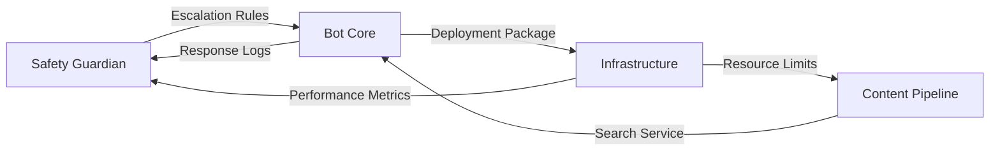

# Agent Coordination Protocol - Ask Eve Assist

## 🚨 CRITICAL UPDATE: Source URLs Are MANDATORY

**Every piece of content shown to users MUST include a direct link back to the source on eveappeal.org.uk**

This is non-negotiable for:
- Medical credibility
- User trust
- Legal compliance
- Clinical governance

## 🤝 Overview

This document coordinates the four specialist agents building Ask Eve Assist. Each agent has clear responsibilities, but success requires seamless collaboration.

## 👥 Agent Roster

| Agent | Primary Focus | Key Deliverables | Status |
|-------|--------------|------------------|---------|
| **Safety Guardian** 🚨 | Escalation & crisis response | EscalationService.ts, safety tests | 🟡 Starting |
| **Content Pipeline** 📚 | Document & search management | ContentService.ts, ingestion scripts | 🟡 Starting |
| **Bot Core** 🤖 | Conversation flow & integration | AskEveBot.ts, channel adapters | 🟡 Starting |
| **Infrastructure** 🏗️ | Azure deployment & costs | ARM templates, CI/CD pipeline | 🟡 Starting |

## 🔄 Integration Points

### Critical Handoffs



### 1. **Safety ↔️ Bot Core**
- Safety Guardian defines ALL escalation triggers
- Bot Core MUST call safety check before ANY response
- Safety has VETO power on any bot behaviour
- Daily review of conversation logs together

### 2. **Content ↔️ Bot Core**
- Content provides search interface
- Bot Core consumes ONLY through approved API
- Content alerts Bot on index updates
- Bot reports failed searches to Content

### 3. **Infrastructure ↔️ Everyone**
- Sets resource limits everyone must respect
- Provides monitoring dashboards
- Handles all deployments
- Manages secrets and configuration

### 4. **Safety ↔️ Content**
- Safety reviews crisis content priority
- Content ensures help resources always indexed
- Coordinate on source attribution
- Joint review of medical content

## 📅 Daily Sync Schedule

### 09:00 - Morning Safety Check
**Led by**: Safety Guardian  
**Duration**: 15 minutes  
**Agenda**:
1. Review overnight escalations
2. Any new triggers needed?
3. Safety test results
4. Blocking issues for the day

### 14:00 - Integration Check
**Led by**: Bot Core  
**Duration**: 30 minutes  
**Agenda**:
1. Integration test results
2. API contract changes
3. Performance issues
4. Tomorrow's priorities

### 17:00 - End of Day Status
**Led by**: Rotating  
**Duration**: 15 minutes  
**Agenda**:
1. Today's progress
2. Blocking issues
3. Handover notes
4. Tomorrow's plan

## 🚦 Decision Authority

### Who Decides What

| Decision Type | Primary | Consulted | Informed |
|--------------|---------|-----------|----------|
| Safety triggers | Safety Guardian | Bot Core | All |
| API contracts | Bot Core | All | - |
| Resource allocation | Infrastructure | All | - |
| Content schema | Content Pipeline | Bot Core | All |
| Deployment timing | Infrastructure | Bot Core, Safety | All |
| Emergency response | Safety Guardian | - | All |

### Escalation Path
1. Try to resolve between relevant agents
2. If blocked > 2 hours, escalate to full team
3. If safety-related, Safety Guardian has override
4. If cost-related, Infrastructure has override

## 📋 Current Sprint Status

### Week 1 Goals (Days 1-7)
- [ ] **Day 1-2**: Infrastructure setup (Infrastructure)
- [ ] **Day 2-3**: Safety engine core (Safety)
- [ ] **Day 3-4**: Content pipeline (Content)
- [ ] **Day 4-5**: Basic bot flow (Bot Core)
- [ ] **Day 6-7**: Integration testing (All)

### Week 2 Goals (Days 8-14)
- [ ] **Day 8-9**: Teams integration (Bot Core)
- [ ] **Day 9-10**: Full safety testing (Safety)
- [ ] **Day 10-11**: Content ingestion (Content)
- [ ] **Day 12**: Load testing (Infrastructure)
- [ ] **Day 13-14**: Production prep (All)

## 🔀 Handoff Protocol

### When Passing Work
```markdown
## Handoff: [From Agent] → [To Agent]
**Date**: [Date/Time]
**Component**: [What's being handed off]

### Work Completed
- [Specific items done]
- [Test coverage]
- [Documentation updated]

### Still Needed
- [Specific remaining tasks]
- [Known issues]
- [Dependencies]

### Critical Notes
- [Anything that might break]
- [Assumptions made]
- [Contact me if...]
```

## 🚨 Blocking Issues Log

### Active Blockers
| Date | Issue | Blocking | Owned By | Status |
|------|-------|----------|----------|---------|
| - | - | - | - | - |

### Resolved (Last 7 Days)
| Date | Issue | Resolution | Time to Resolve |
|------|-------|------------|-----------------|
| - | - | - | - |

## 📊 Integration Test Status

### Core Integration Tests
| Test Scenario | Owner | Status | Last Run |
|--------------|-------|---------|----------|
| Safety trigger → Bot response | Safety + Bot | 🔴 Not Started | - |
| Content search → Bot display | Content + Bot | 🔴 Not Started | - |
| Bot deployment → Azure | Bot + Infra | 🔴 Not Started | - |
| Cost monitoring → Alerts | Infrastructure | 🔴 Not Started | - |
| Nurse escalation → Teams | Bot + Safety | 🔴 Not Started | - |

## 🎯 Quality Gates

### Before ANY Deployment
- [ ] All safety tests passing (Safety Guardian)
- [ ] Content pipeline validated (Content Pipeline)
- [ ] Every response has source URL (Bot Core + Content)
- [ ] Integration tests green (Bot Core)
- [ ] Cost projection confirmed (Infrastructure)
- [ ] Security scan clean (Infrastructure)

### Before Production
- [ ] 48 hours in staging
- [ ] Load test completed
- [ ] Nurse team trained
- [ ] Rollback tested
- [ ] All agents sign off

## 💬 Communication Channels

### Preferred Methods
1. **Urgent**: Direct message in session
2. **Blocking**: Update this file + message
3. **FYI**: Update relevant docs
4. **Questions**: Comment in code

### Status Indicators
- 🟢 **Green**: On track, no issues
- 🟡 **Yellow**: Minor issues, managing
- 🔴 **Red**: Blocked, need help
- ✅ **Done**: Complete and tested

## 📝 Shared Standards

### Code Standards
- TypeScript for everything
- Tests for all safety paths
- Comments for complex logic
- Meaningful variable names

### Documentation Standards
- Update docs with code
- Include examples
- Explain the why
- Keep it current

### Git Commit Format
```
[Agent] type: description

- Specific change 1
- Specific change 2

Refs: #issue
```

Example:
```
[Safety] feat: add postmenopausal bleeding trigger

- Added to HIGH_CONCERN_SYMPTOMS
- Includes variations and misspellings
- Added comprehensive tests

Refs: #safety-triggers
```

## 🔄 Daily Update Template

Each agent updates their section daily:

### Safety Guardian Update - [Date]
**Status**: 🟡 Yellow  
**Today**: Implemented crisis detection for suicide ideation  
**Blockers**: Need Bot Core message interface  
**Tomorrow**: Testing emotional support triggers  

### Content Pipeline Update - [Date]
**Status**: 🟢 Green  
**Today**: Set up document parsing for PDFs  
**Blockers**: None  
**Tomorrow**: Implement website crawler  

### Bot Core Update - [Date]
**Status**: 🟡 Yellow  
**Today**: Basic message handling working  
**Blockers**: Waiting for safety interface  
**Tomorrow**: Teams adapter implementation  

### Infrastructure Update - [Date]
**Status**: 🟢 Green  
**Today**: ARM template complete  
**Blockers**: None  
**Tomorrow**: CI/CD pipeline setup  

---

## 🚀 Next Actions (Update Daily)

1. **Immediate** (Today):
   - [ ] [Agent]: [Specific task]

2. **Tomorrow**:
   - [ ] [Agent]: [Specific task]

3. **Blocking Others**:
   - [ ] [Agent]: [What others are waiting for]

---

**Remember**: We're building something that matters. Clear communication between agents ensures we deliver a safe, effective solution that could genuinely help someone in a health crisis. Every handoff matters.