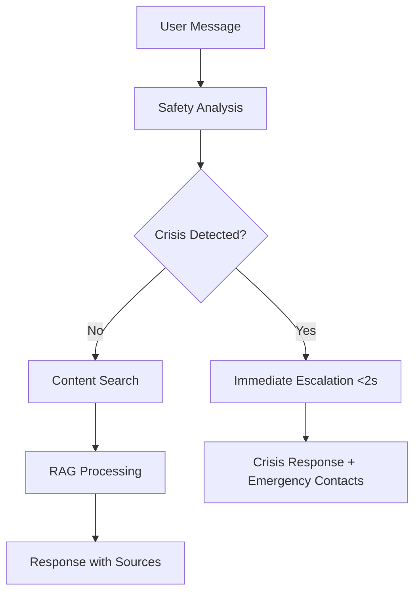

# Ask Eve Assist - Microsoft 365 Agents SDK Implementation Guide

## Overview

This document outlines the complete Microsoft 365 Agents SDK integration for Ask Eve Assist, a healthcare chatbot providing gynaecological health information from The Eve Appeal. The implementation includes comprehensive safety systems, MHRA compliance, and multi-channel support.

## Architecture

### Core Components

1. **AgentsSDKBot** - Main bot implementation using Microsoft 365 Agents SDK
2. **SafetyServiceAdapter** - Bridges safety services with bot interface
3. **SupabaseContentService** - MHRA-compliant content service using Supabase database
4. **BotServer** - Express server with web chat widget and API endpoints
5. **TeamsAdapter** - Microsoft Teams channel integration
6. **EscalationService** - Crisis detection and response system

### Safety-First Design



## Key Features

### 1. Crisis Response System
- **Sub-2 second response time** for crisis detection
- **Multi-layer safety analysis** (exact match, fuzzy match, pattern recognition, contextual analysis)
- **Immediate escalation** with emergency contacts:
  - Samaritans: 116 123
  - NHS 111: 111
  - Emergency Services: 999

### 2. MHRA Compliance
- **No medical advice generation** beyond provided content
- **Mandatory source attribution** for all health information
- **Verified Eve Appeal sources only**
- **Bot disclosure** clearly stating limitations

### 3. RAG Implementation
- **Query cleaning** and preparation
- **Content retrieval** from Supabase database
- **Source validation** and URL verification
- **AI response generation** with OpenAI GPT-4o-mini
- **Source attribution** in all responses

### 4. Multi-Channel Support
- **Web chat widget** with emergency contacts
- **Microsoft Teams integration** with rich cards
- **Direct API endpoints** for custom integrations

## Setup and Deployment

### Prerequisites

```bash
# Install dependencies
npm install

# Set environment variables
OPENAI_API_KEY=your_openai_api_key
TEAMS_WEBHOOK_URL=your_teams_webhook
BOT_PORT=3000
```

### Running the Bot Server

```bash
# Development
npm run dev:bot

# Production
npm run build
npm run start:bot
```

### Testing

```bash
# Run all bot tests
npm run test:bot

# Run integration tests
npm run test:integration

# Run safety system tests
npm run test:safety
```

## Usage Examples

### Web Chat Widget

Access the web chat widget at: `http://localhost:3000/widget`

The widget includes:
- Emergency contacts prominently displayed
- Bot disclosure message
- Suggested actions for common queries
- Source attribution for all responses

### API Integration

```javascript
// Direct chat API
const response = await fetch('/api/chat', {
  method: 'POST',
  headers: { 'Content-Type': 'application/json' },
  body: JSON.stringify({
    message: 'What are ovarian cancer symptoms?',
    conversationId: 'user-session-123',
    userId: 'user-456'
  })
});

const data = await response.json();
// data.responses contains bot responses with source attribution
```

### Teams Integration

```typescript
import { TeamsAdapter } from './adapters/TeamsAdapter';
import { AgentsSDKBot } from './bot/AgentsSDKBot';

const bot = new AgentsSDKBot(options);
const teamsAdapter = new TeamsAdapter(bot);

// Teams adapter handles:
// - Welcome cards for new members
// - Rich message formatting
// - Teams-specific suggested actions
```

## Safety Systems

### Crisis Detection

The bot uses a multi-layer safety analysis system:

1. **Exact Match Detection** - Direct keyword matching for crisis phrases
2. **Fuzzy Match Detection** - Handles typos and variations
3. **Pattern Recognition** - Regex patterns for complex expressions
4. **Contextual Analysis** - Conversation history and user profile analysis

### Emergency Response Types

```typescript
// Self-harm escalation
{
  text: "I'm concerned about what you've shared. If you're having thoughts of self-harm, please reach out for urgent support:\n\n• Samaritans: 116 123 (free, 24/7)\n• Text SHOUT to 85258\n• Emergency services: 999",
  suggestedActions: ["Call Samaritans", "Emergency Services", "Text SHOUT"]
}

// Medical emergency escalation  
{
  text: "This sounds like it may need urgent medical attention. Please:\n\n• Call 999 for emergency services\n• Contact your GP urgently\n• Visit A&E if symptoms are severe",
  suggestedActions: ["Call 999", "Contact GP", "Find A&E"]
}
```

## Content Management

### PiF Content Structure

Patient Information (PiF) documents are processed into searchable chunks:

```json
{
  "id": "ovarian-cancer-symptoms-chunk-1",
  "content": "Common symptoms of ovarian cancer include persistent bloating, feeling full quickly when eating, pelvic or abdominal pain, and needing to urinate urgently or more often.",
  "source": "The Eve Appeal - Ovarian Cancer Guide",
  "sourceUrl": "https://eveappeal.org.uk/gynae-health/ovarian-cancer",
  "title": "Ovarian Cancer Symptoms"
}
```

### Content Search Algorithm

1. **Query Cleaning** - Remove filler words, normalize text
2. **Relevance Scoring** - TF-IDF with health topic boosters
3. **Source Validation** - Ensure valid Eve Appeal URLs
4. **Content Truncation** - Limit response length while preserving meaning

## Microsoft 365 Agents SDK Integration

### Bot Implementation

```typescript
export class AgentsSDKBot extends ActivityHandler {
  private readonly agentApplication: AgentApplication<TurnState>;
  private readonly openai: OpenAI;
  
  constructor(options: AgentOptions) {
    super();
    this.agentApplication = new AgentApplication<TurnState>();
    this.setupMessageHandlers();
  }

  private setupMessageHandlers(): void {
    this.agentApplication.onMessage(/.*/i, async (context: TurnContext, _state: TurnState) => {
      await this.handleMessage(context);
    });
  }
}
```

### Conversation State Management

- **In-memory conversation history** with Map-based storage
- **Turn context integration** with Bot Framework
- **Message history tracking** for safety analysis
- **Session management** across multiple interactions

## Testing Strategy

### Test Coverage

- **Unit Tests** - Individual component testing
- **Integration Tests** - End-to-end scenario testing
- **Safety Tests** - Crisis response validation
- **Performance Tests** - Response time verification

### Key Test Scenarios

```typescript
// Crisis response time test
it('should maintain sub-2-second crisis response time', async () => {
  const startTime = Date.now();
  await bot.handleMessage(crisisContext);
  const responseTime = Date.now() - startTime;
  
  expect(responseTime).toBeLessThan(2000);
});

// MHRA compliance test
it('should only provide content with valid source URLs', async () => {
  await bot.handleMessage(healthQueryContext);
  
  expect(response.attachments[0].content.buttons[0].value)
    .toMatch(/^https:\/\/eveappeal\.org\.uk/);
});
```

## Monitoring and Logging

### Metrics Tracked

- **Response times** (crisis vs. normal queries)
- **Safety escalations** by type and frequency
- **Content search success rates**
- **Source attribution compliance**
- **Error rates** and failure modes

### Logging Levels

```typescript
// Crisis events
logger.critical('Crisis detected', { userId, severity, triggers });

// Safety analysis
logger.info('Safety analysis completed', { severity, confidence, analysisTime });

// Content retrieval
logger.debug('Content search results', { query, relevanceScore, sourceUrl });
```

## Deployment Considerations

### Production Requirements

1. **Environment Variables**
   - `OPENAI_API_KEY` - OpenAI API access
   - `TEAMS_WEBHOOK_URL` - Teams notifications
   - `NODE_ENV=production` - Production mode

2. **Database Setup**
   - Crisis event logging
   - Conversation history persistence
   - User profile management

3. **Monitoring Setup**
   - Health check endpoints
   - Performance metrics
   - Error alerting

### Security Considerations

- **Input validation** for all user messages
- **Rate limiting** for API endpoints
- **CORS configuration** for web widget
- **Secure headers** for all responses
- **PII handling** in conversation logs

## Future Enhancements

### Planned Features

1. **Enhanced Teams Integration**
   - Adaptive cards for rich interactions
   - Meeting integration for health discussions
   - Bot commands for quick access

2. **Advanced Safety Features**
   - Machine learning-based risk assessment
   - Personalized safety thresholds
   - Professional handoff workflows

3. **Content Improvements**
   - Real-time content updates
   - Multilingual support
   - Accessibility enhancements

4. **Analytics Dashboard**
   - Usage patterns analysis
   - Safety incident reporting
   - Content effectiveness metrics

## Support and Maintenance

### Contact Information

- **Technical Support**: Level AI Development Team
- **Content Updates**: The Eve Appeal Medical Team
- **Safety Incidents**: Immediate escalation to clinical staff

### Maintenance Schedule

- **Daily**: Health checks and error monitoring
- **Weekly**: Content updates and safety rule reviews
- **Monthly**: Performance optimization and security audits
- **Quarterly**: Full system reviews and compliance checks

---

**Important**: This system handles sensitive health information and crisis situations. All modifications must undergo rigorous testing and clinical review before deployment.