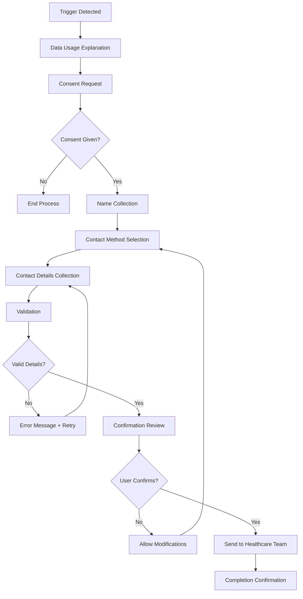

# Ask Eve Assist - Nurse Escalation System Documentation

## 🩺 Overview

The Ask Eve Assist Nurse Escalation System provides a GDPR-compliant pathway for healthcare users to connect with registered nurses when they need additional support beyond the chatbot's information services. This system was designed based on analysis of 15 User Acceptance Testing (UAT) scenario cards to ensure real-world healthcare workflow integration.

## 🎯 Key Features

### UAT-Informed Design
- **15 Healthcare Scenarios Analyzed**: Real user journeys from UAT_ScenarioCards v0.3.pdf
- **9 Escalation Triggers**: Context-aware pattern matching for healthcare situations
- **Priority Routing**: Low, medium, and high priority escalations based on scenario urgency
- **Crisis Differentiation**: Nurse support separate from emergency crisis detection

### GDPR-Compliant Data Collection
1. **Data Usage Explanation**: Clear explanation of how collected data will be used
2. **Informed Consent**: Explicit consent gathering before any data collection
3. **Name Collection**: Personalized interaction with name validation
4. **Contact Method Selection**: User choice between phone or email contact
5. **Contact Details**: UK-format phone number or email validation
6. **Confirmation & Modification**: Review and edit capability before submission
7. **Completion**: Automated handover to healthcare team

### Healthcare Integration
- **Teams Webhook Notifications**: Automated nurse notifications with conversation context
- **Conversation Summarization**: AI-generated summaries for healthcare handovers
- **Priority-Based Routing**: High priority cases flagged for immediate attention
- **UK Healthcare Compliance**: Phone and email validation for NHS integration

## 🔧 Technical Implementation

### Core Components

#### EscalationState Interface
```typescript
interface EscalationState {
    isActive: boolean;
    step: 'none' | 'consent' | 'name' | 'contact_method' | 'contact_details' | 'confirmation' | 'completed';
    triggerType?: string;
    scenario?: string;
    priority?: 'low' | 'medium' | 'high';
    startTime?: number;
    consentGiven?: boolean;
    userName?: string;
    contactMethod?: 'phone' | 'email';
    contactDetails?: string;
    timeoutWarning?: boolean;
}
```

#### Escalation Triggers
```typescript
interface EscalationTrigger {
    pattern: RegExp;
    scenario: string;
    priority: 'low' | 'medium' | 'high';
    description: string;
    uatCard: string;
}
```

### UAT-Based Escalation Patterns

| UAT Card | Trigger Example | Scenario Type | Priority | Description |
|----------|----------------|---------------|----------|-------------|
| Card 1 | "I'm scared about my results" | emotional_distress | medium | Abnormal smear test anxiety |
| Card 4 | "I'm worried about the treatment" | emotional_distress | medium | Treatment concerns |
| Card 11 | "I can't cope with this" | emotional_distress | high | Emotional crisis requiring immediate support |
| Card 12 | "My partner doesn't understand" | support_request | medium | Relationship/family support needs |
| Card 14 | "I can't get an appointment" | healthcare_access | high | GP access barriers |
| Card 15 | "I'm confused about what to do next" | information_request | low | Navigation and process confusion |
| Direct | "I want to speak to a nurse" | direct_nurse_request | medium | Explicit nurse request |
| Post-Info | "I'm still worried after reading" | post_information_anxiety | medium | Continued anxiety after information |
| Appointment | "I need help booking an appointment" | appointment_assistance | medium | Practical healthcare navigation |

## 📋 Workflow Process

### 1. Trigger Detection
- **Pattern Matching**: Real-time analysis of user messages for escalation triggers
- **Context Awareness**: Integration with conversation history and user emotional state
- **Priority Assessment**: Automatic priority assignment based on trigger type and scenario

### 2. GDPR Data Collection Flow



### 3. Healthcare Team Notification

```typescript
interface TeamNotification {
    escalationType: string;
    priority: 'low' | 'medium' | 'high';
    patientName: string;
    contactMethod: 'phone' | 'email';
    contactDetails: string;
    conversationSummary: string;
    triggerScenario: string;
    timestamp: string;
    estimatedResponseTime: string;
}
```

## 🔒 Security & Compliance

### GDPR Compliance
- **Data Minimization**: Only collect essential information for nurse contact
- **Purpose Limitation**: Data used solely for healthcare professional connection
- **Consent Management**: Explicit, informed consent before any data collection
- **Right to Modify**: Users can change details before final submission
- **Automatic Cleanup**: Data lifecycle management with Azure Table Storage TTL

### UK Healthcare Compliance
- **Phone Number Format**: 07xxx xxx xxx validation for UK mobile numbers
- **Email Domain Support**: .uk domain validation alongside international formats
- **NHS Integration Ready**: Format compatible with NHS contact systems
- **Professional Handover**: Structured data format for healthcare team integration

### Security Features
- **Timeout Management**: 10-minute escalation timeout with 8-minute warnings
- **Validation Layers**: Multiple validation steps for data integrity
- **State Persistence**: Secure conversation state management
- **Error Handling**: Healthcare-appropriate error messages and recovery

## 📊 Monitoring & Analytics

### Escalation Metrics
- **Trigger Distribution**: Analysis of which scenarios trigger most escalations
- **Response Times**: Time from trigger to completion measurement
- **User Completion Rates**: Percentage of users completing the full workflow
- **Priority Distribution**: Analysis of high vs medium vs low priority cases

### Healthcare Team Metrics
- **Nurse Response Times**: Time from notification to patient contact
- **Case Resolution Rates**: Successful nurse-patient connections
- **Follow-up Requirements**: Cases requiring additional healthcare support
- **User Satisfaction**: Post-escalation feedback and outcomes

## 🚀 Deployment Requirements

### Environment Variables
```bash
# Teams Integration
TEAMS_WEBHOOK_URL=https://your-teams-webhook-url
EMERGENCY_CONTACT_WEBHOOK=https://your-emergency-webhook

# Timeout Configuration
ESCALATION_TIMEOUT_MS=600000  # 10 minutes
ESCALATION_WARNING_MS=480000  # 8 minutes

# Healthcare Team Configuration
NURSE_TEAM_EMAIL=nurses@eveappeal.org.uk
URGENT_ESCALATION_PHONE=+44XXXXXXXXXX
```

### Azure Services Integration
- **Azure Table Storage**: Escalation state persistence with GDPR TTL
- **Application Insights**: Escalation monitoring and analytics
- **Teams Webhooks**: Healthcare team notification system
- **Azure AI**: Conversation summarization for handovers

## 🧪 Testing Strategy

### UAT Scenario Testing
1. **Card-by-Card Validation**: Test each UAT scenario individually
2. **Priority Routing**: Verify correct priority assignment per scenario
3. **GDPR Flow Completion**: End-to-end data collection workflow
4. **Teams Integration**: Notification delivery and format validation
5. **Error Handling**: Invalid input and timeout scenario testing

### Production Validation
- **Load Testing**: Multiple simultaneous escalation requests
- **Integration Testing**: Teams webhook reliability and response times
- **Security Testing**: Data validation and GDPR compliance verification
- **Performance Testing**: Escalation trigger detection speed (<100ms target)

## 📈 Future Enhancements

### Planned Improvements
- **Video Call Integration**: Direct video consultation scheduling
- **Appointment Booking**: Integration with NHS appointment systems  
- **Multi-language Support**: Escalation workflow in multiple languages
- **AI Triage**: Enhanced priority assessment using conversation analysis
- **Mobile App Integration**: Native mobile app escalation workflows

### Analytics Enhancements
- **Predictive Escalation**: AI-powered escalation likelihood scoring
- **Outcome Tracking**: Long-term patient outcome measurement
- **Quality Metrics**: Nurse satisfaction and case resolution analytics
- **Cost Analysis**: Healthcare cost impact and efficiency measurement

---

## 📞 Support & Contact

### Technical Support
- **Infrastructure Issues**: infrastructure@wearelevel.ai
- **Security Concerns**: security@wearelevel.ai
- **Integration Support**: Technical documentation and API support

### Healthcare Team Support
- **Nurse Training**: Escalation system training and documentation
- **Workflow Integration**: NHS system integration assistance
- **Quality Assurance**: Healthcare outcome monitoring and improvement

**Ask Eve Assist Nurse Escalation System** - Bridging the gap between AI healthcare information and professional nursing support with GDPR compliance and UAT-informed design.