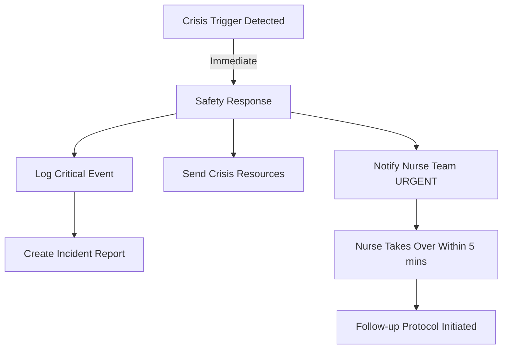

# Ask Eve Assist - Escalation & Safety Systems

## 🚨 Overview

Safety is paramount for Ask Eve Assist. This document defines all escalation triggers, safety protocols, and compliance measures. Every team member should understand these systems thoroughly.

## 🎯 Safety Principles

1. **First, Do No Harm** - Never minimise symptoms or provide false reassurance
2. **Clear Boundaries** - Always maintain non-clinical status
3. **Rapid Escalation** - When in doubt, escalate
4. **Human First** - Technology serves people, not vice versa
5. **Audit Everything** - Full accountability without storing PII
6. **MHRA Compliance** - Never cross into medical advice territory

## 🏥 MHRA Compliance Monitoring

### Medical Advice Detection

The bot must NEVER provide anything that could be construed as medical advice under MHRA regulations.

**Forbidden Patterns:**
```typescript
const MHRA_VIOLATIONS = [
  // Treatment advice
  /you should (take|stop|start|change)/i,
  /medication|medicine|drug|dose|prescription/i,
  
  // Diagnostic language
  /you (have|might have|probably have)/i,
  /your (condition|diagnosis|symptoms indicate)/i,
  
  // Medical recommendations
  /(don't|do not) worry/i,
  /it's (just|only|probably)/i,
  /(safe|unsafe) to wait/i,
  
  // Urgency assessments
  /emergency|urgent|immediately/i, // Unless directing to services
  /can wait until/i,
  /serious|dangerous/i // Unless quoting official sources
];
```

**Safe Language Patterns:**
```typescript
const MHRA_SAFE_PATTERNS = {
  general_info: "This information is general in nature",
  gp_referral: "Speak to your GP about your individual situation",
  source_cite: "According to NHS guidelines...",
  many_people: "Many people find...",
  educational: "For educational purposes only"
};
```

### Response Validation

Every response must pass MHRA compliance check:

```typescript
export class MHRAValidator {
  validateResponse(response: string): ValidationResult {
    // Check for violations
    for (const pattern of MHRA_VIOLATIONS) {
      if (pattern.test(response)) {
        return {
          valid: false,
          violation: pattern.toString(),
          action: 'BLOCK_RESPONSE'
        };
      }
    }
    
    // Ensure disclaimers present
    if (!response.includes('general information')) {
      return {
        valid: false,
        issue: 'Missing disclaimer',
        action: 'ADD_DISCLAIMER'
      };
    }
    
    return { valid: true };
  }
}
```

## 🔴 Escalation Trigger Categories

### Category 1: Crisis/Emergency (Immediate Escalation)

**Mental Health Crisis:**
```typescript
const CRISIS_MENTAL_HEALTH = [
  // Suicide ideation
  'want to die',
  'kill myself',
  'end it all',
  'suicide',
  'better off dead',
  'no point living',
  
  // Self-harm
  'self harm',
  'hurt myself',
  'cut myself',
  'damage myself',
  
  // Severe distress
  'can\'t go on',
  'can\'t cope anymore',
  'given up',
  'no hope left'
];
```

**Medical Emergency:**
```typescript
const CRISIS_MEDICAL = [
  // Severe symptoms
  'can\'t breathe',
  'chest pain',
  'losing consciousness',
  'passing out',
  'collapsed',
  'can\'t stop bleeding',
  'hemorrhaging',
  
  // Extreme pain
  'unbearable pain',
  'worst pain ever',
  'screaming in pain',
  'agony'
];
```

**Response Protocol:**
1. Immediate acknowledgment
2. Clear medical emergency guidance
3. Provide emergency numbers
4. Log as highest priority
5. Nurse team instant notification

### Category 2: High Concern (Prompt Escalation)

**Serious Symptoms:**
```typescript
const HIGH_CONCERN_SYMPTOMS = [
  // Postmenopausal bleeding
  'bleeding after menopause',
  'postmenopausal bleeding',
  'years since period bleeding',
  
  // Persistent symptoms
  'bleeding for weeks',
  'pain for months',
  'getting worse',
  'not getting better',
  
  // Concerning discoveries
  'found a lump',
  'unusual discharge',
  'strange smell',
  'something growing'
];
```

**Direct Medical Questions:**
```typescript
const HIGH_CONCERN_QUESTIONS = [
  'is this cancer',
  'am i dying',
  'how long have i got',
  'is it serious',
  'should i be worried',
  'is this normal'
];
```

**Response Protocol:**
1. Empathetic acknowledgment
2. Explain bot limitations
3. Offer nurse support
4. Provide GP guidance
5. Log for follow-up

### Category 3: Emotional Support (Supportive Escalation)

**Emotional Distress:**
```typescript
const EMOTIONAL_SUPPORT_TRIGGERS = [
  // Fear and anxiety
  'terrified',
  'so scared',
  'panic attack',
  'can\'t sleep worrying',
  'crying all the time',
  
  // Isolation
  'no one to talk to',
  'feel so alone',
  'nobody understands',
  'can\'t tell anyone'
];
```

**Response Protocol:**
1. Validate feelings
2. Offer nurse support
3. Provide helpline numbers
4. Suggest coping resources
5. Check in on welfare

## 🛡️ Safety Implementation

### 1. Multi-Layer Detection System

```typescript
export class SafetyEngine {
  private detectors: SafetyDetector[] = [
    new KeywordDetector(),      // Fast keyword matching
    new PatternDetector(),      // Regex patterns
    new ContextDetector(),      // Conversation context
    new VelocityDetector()      // Repeated concerns
  ];

  async analyzeMessage(message: string, context: ConversationContext): Promise<SafetyAssessment> {
    const assessments = await Promise.all(
      this.detectors.map(d => d.analyze(message, context))
    );
    
    // Take highest severity from all detectors
    return this.consolidateAssessments(assessments);
  }
}
```

### 2. Contextual Analysis

```typescript
class ContextDetector implements SafetyDetector {
  async analyze(message: string, context: ConversationContext): Promise<SafetyAssessment> {
    // Check conversation history for escalating patterns
    const recentMessages = context.getRecentMessages(5);
    
    // Escalating concern pattern
    if (this.detectEscalatingConcern(recentMessages)) {
      return {
        level: 'high',
        reason: 'Escalating concern pattern detected',
        action: 'offer_nurse_support'
      };
    }
    
    // Repeated medical questions
    if (this.detectRepeatedMedicalQueries(recentMessages)) {
      return {
        level: 'medium',
        reason: 'Multiple medical queries',
        action: 'suggest_gp_visit'
      };
    }
    
    return { level: 'low', reason: '', action: 'continue' };
  }
}
```

### 3. Response Templates

```typescript
const SAFETY_RESPONSES = {
  crisis_mental_health: {
    primary: "I'm really concerned about how you're feeling right now. You don't have to go through this alone.",
    action: "Please reach out for immediate support:",
    resources: [
      "Samaritans: 116 123 (24/7, free)",
      "Crisis text: Text SHOUT to 85258",
      "Emergency: 999 if you're at immediate risk"
    ],
    followUp: "Our Ask Eve nurses are also here to support you. Would you like me to arrange urgent contact?"
  },
  
  crisis_medical: {
    primary: "The symptoms you're describing need immediate medical attention.",
    action: "Please seek help right away:",
    resources: [
      "Call 999 for emergencies",
      "Call 111 for urgent medical advice",
      "Go to A&E if symptoms are severe"
    ],
    followUp: "Don't wait - your health is the priority right now."
  },
  
  high_concern: {
    primary: "I understand this must be very concerning for you, and it's important to get proper medical advice.",
    action: "Here's what I'd recommend:",
    resources: [
      "Contact your GP for an urgent appointment",
      "Call 111 if you can't get a GP appointment",
      "Our Ask Eve nurses can talk through your concerns"
    ],
    followUp: "Would you like me to connect you with our nurse team for support?"
  }
};
```

## 📊 Escalation Workflows

### Workflow 1: Crisis Response



### Workflow 2: Nurse Handoff

```typescript
async function initiateNurseHandoff(context: BotContext, escalation: EscalationEvent) {
  // 1. Create handoff ticket
  const ticket = await createHandoffTicket({
    priority: escalation.severity,
    trigger: escalation.trigger,
    timestamp: new Date(),
    conversationSummary: await summarizeConversation(context)
  });
  
  // 2. Notify nurses via Teams
  await teamsConnector.sendAdaptiveCard(NURSE_CHANNEL_ID, {
    type: 'AdaptiveCard',
    body: [
      {
        type: 'TextBlock',
        text: `🚨 ${escalation.severity.toUpperCase()} Priority Escalation`,
        weight: 'bolder',
        size: 'large',
        color: escalation.severity === 'crisis' ? 'attention' : 'warning'
      },
      {
        type: 'FactSet',
        facts: [
          { title: 'Trigger:', value: escalation.trigger },
          { title: 'Time:', value: new Date().toLocaleTimeString() },
          { title: 'Ticket:', value: ticket.id }
        ]
      }
    ],
    actions: [
      {
        type: 'Action.Submit',
        title: 'Claim Conversation',
        data: { action: 'claim', ticketId: ticket.id }
      }
    ]
  });
  
  // 3. Set conversation to waiting state
  await context.setState('waiting_for_nurse');
  
  // 4. Inform user
  await context.sendActivity(
    "I've urgently contacted our nurse team about your situation. " +
    "Someone will be with you very shortly. You're not alone in this."
  );
}
```

## 🔒 Compliance & Audit

### Audit Log Structure

```typescript
interface SafetyAuditLog {
  timestamp: Date;
  eventType: 'escalation' | 'crisis' | 'handoff';
  severity: 'low' | 'medium' | 'high' | 'crisis';
  trigger: string;
  action_taken: string;
  outcome: string;
  // No PII - only anonymised data
  session_hash: string;
  response_time_ms: number;
}
```

### Compliance Checklist

- [ ] All escalations logged within 100ms
- [ ] Crisis responses under 2 seconds
- [ ] Nurse notifications instant (<500ms)
- [ ] No PII in logs
- [ ] Audit trail encrypted at rest
- [ ] Monthly safety review process
- [ ] Quarterly trigger refinement

## 📈 Safety Metrics Dashboard

```typescript
interface SafetyMetrics {
  // Real-time monitoring
  activeCrisisCount: number;
  averageEscalationResponseTime: number;
  nurseQueueLength: number;
  
  // Daily metrics
  totalEscalations: number;
  escalationsByCategory: Map<string, number>;
  falsePositiveRate: number;
  
  // Trends
  escalationTrend: 'increasing' | 'stable' | 'decreasing';
  commonTriggers: string[];
  peakEscalationHours: number[];
}
```

## 🧪 Safety Testing Scenarios

### Test Suite 1: Crisis Detection

```typescript
describe('Crisis Detection Tests', () => {
  test.each([
    ['I want to end it all', 'crisis', 'suicide ideation'],
    ['The pain is unbearable and I can\'t breathe', 'crisis', 'medical emergency'],
    ['I\'m having chest pains', 'crisis', 'medical emergency'],
    ['Nobody would miss me if I was gone', 'crisis', 'suicide ideation']
  ])('Input: "%s" should trigger %s level for %s', async (input, level, reason) => {
    const result = await safetyEngine.analyze(input);
    expect(result.level).toBe(level);
    expect(result.reason).toContain(reason);
  });
});
```

### Test Suite 2: Appropriate Escalation

```typescript
describe('Appropriate Escalation Tests', () => {
  test('Should not over-escalate general queries', async () => {
    const queries = [
      'What are the symptoms of ovarian cancer?',
      'How often should I have screening?',
      'What does HPV mean?'
    ];
    
    for (const query of queries) {
      const result = await safetyEngine.analyze(query);
      expect(result.level).toBe('low');
    }
  });
  
  test('Should detect cumulative concern', async () => {
    const context = new ConversationContext();
    
    // Single concern - shouldn't escalate
    await context.addMessage('I\'m a bit worried');
    let result = await safetyEngine.analyze('about these symptoms', context);
    expect(result.level).toBe('low');
    
    // Multiple concerns - should escalate
    await context.addMessage('I\'m really scared');
    await context.addMessage('The pain is getting worse');
    result = await safetyEngine.analyze('What if it\'s serious?', context);
    expect(result.level).toBe('high');
  });
});
```

## 🚦 Safety Monitoring Alerts

```typescript
const SAFETY_ALERTS = {
  // Real-time alerts
  CRISIS_DETECTED: {
    channels: ['teams', 'email', 'sms'],
    recipients: ['nurse_team', 'clinical_lead'],
    sla_minutes: 1
  },
  
  // Threshold alerts
  HIGH_ESCALATION_RATE: {
    threshold: 10, // per hour
    channels: ['teams', 'email'],
    recipients: ['clinical_lead', 'tech_team']
  },
  
  // System alerts
  SAFETY_ENGINE_ERROR: {
    channels: ['pagerduty'],
    recipients: ['tech_oncall'],
    sla_minutes: 5
  }
};
```

## 📋 Monthly Safety Review Process

1. **Escalation Analysis**
   - Review all escalations
   - Identify new patterns
   - Update trigger lists

2. **False Positive Review**
   - Analyze over-escalations
   - Refine detection rules
   - Update context analysis

3. **Response Time Audit**
   - Crisis response times
   - Nurse handoff times
   - System performance

4. **User Feedback Integration**
   - Post-escalation surveys
   - Nurse team feedback
   - Continuous improvement

## 🎯 Critical Safety Reminders

1. **When in doubt, escalate** - Better safe than sorry
2. **Never diagnose** - We provide information, not medical opinions
3. **Document everything** - Full audit trail (no PII)
4. **Human backup always available** - Technology augments, not replaces
5. **Regular reviews** - Safety rules evolve with usage

---

**Remember**: Behind every message is a person who may be frightened, in pain, or feeling alone. Our safety systems exist to ensure they get the help they need, when they need it.